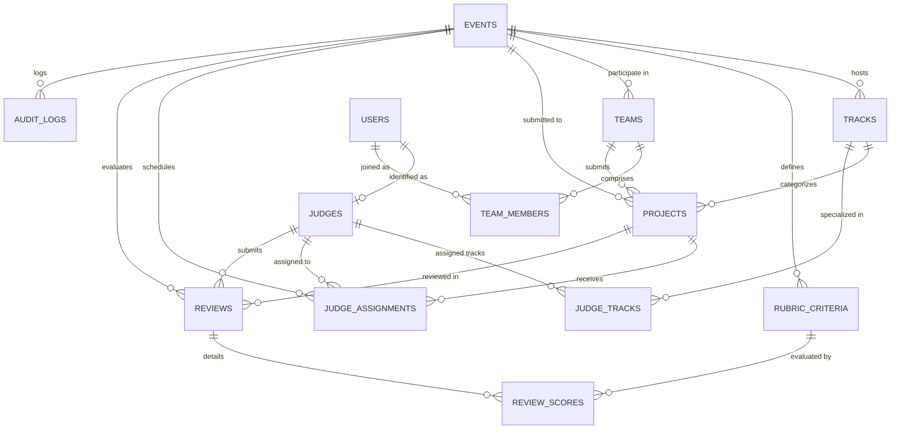

# Judgely Data Model Specification

## 1. Relational Entity Architecture

Judgely utilizes a normalized relational data model implemented in SQLite with foreign key enforcement (`PRAGMA foreign_keys = ON;`) and write-ahead logging (`WAL`) for concurrent read performance.



---

## 2. Table Definitions

### `events`
Stores hackathon event instances and global deadlines.
- `id` (TEXT, PK): Unique event identifier (e.g. `evt_01`).
- `name` (TEXT, NOT NULL): Official event name.
- `submissions_close` (TEXT, NOT NULL): ISO 8601 UTC timestamp enforced by the submission barrier.
- `created_at` (TEXT, NOT NULL): Timestamp of creation.

### `tracks`
Challenge categories belonging to an event.
- `id` (TEXT, PK): Track identifier (e.g. `trk_01`).
- `event_id` (TEXT, FK): References `events(id)`.
- `name` (TEXT, NOT NULL): Track title (e.g. "Developer tools").

### `rubric_criteria`
Configurable scoring dimensions.
- `id` (TEXT, PK): Unique criterion identifier.
- `event_id` (TEXT, FK): References `events(id)`.
- `name` (TEXT, NOT NULL): Criterion key (e.g. `functionality`).
- `description` (TEXT): Guidelines for judges.
- `weight` (REAL, NOT NULL): Weight fraction (e.g. `0.40`).
- `max_score` (REAL, NOT NULL): Scale ceiling (e.g. `5.0`).

### `users`
Authenticated identities and roles.
- `id` (TEXT, PK): User identifier (`usr_organizer`, `usr_judge_a`, etc.).
- `email` (TEXT, UNIQUE): User email address.
- `name` (TEXT, NOT NULL): Display name.
- `role` (TEXT, NOT NULL): `organizer`, `judge`, `participant`, or `visitor`.
- `session_token` (TEXT, UNIQUE): Session credential matched in auth middleware.
- `created_at` (TEXT, NOT NULL): Timestamp of account creation.

### `judges` & `judge_tracks`
Judge profiles and their declared track expertise.
- `judges.id` (TEXT, PK): Judge identifier (e.g. `jdg_01`).
- `judges.user_id` (TEXT, FK): References `users(id)`.
- `judges.name` (TEXT, NOT NULL): Judge name.
- `judges.email` (TEXT, NOT NULL): Contact email.
- `judge_tracks`: Join table (`judge_id REFERENCES judges(id)`, `track_id REFERENCES tracks(id)`).

### `teams` & `team_members`
Participant teams and relational membership roster.
- `teams.id` (TEXT, PK): Team identifier (e.g. `tm_01`).
- `teams.event_id` (TEXT, FK): References `events(id)`.
- `teams.name` (TEXT, NOT NULL): Team name.
- `team_members`: Join table (`team_id REFERENCES teams(id)`, `email TEXT`, `user_id REFERENCES users(id)`).

### `projects`
Submitted hackathon projects.
- `id` (TEXT, PK): Project identifier (e.g. `prj_01`).
- `event_id` (TEXT, FK): References `events(id)`.
- `team_id` (TEXT, FK): References `teams(id)`.
- `track_id` (TEXT, FK): References `tracks(id)`.
- `title` (TEXT, NOT NULL): Project title.
- `summary` (TEXT): Elevator pitch.
- `repo_url` (TEXT): Source repository URL.
- `demo_url` (TEXT): Working demonstration URL.
- `submitted_at` (TEXT, NOT NULL): Timestamp of submission.
- `status` (TEXT, NOT NULL): `submitted`, `draft`, `withdrawn`, `disqualified`.

### `judge_assignments`
Formal assignment schedule connecting judges and projects.
- `id` (TEXT, PK): Assignment ID.
- `event_id` (TEXT, FK): References `events(id)`.
- `project_id` (TEXT, FK): References `projects(id)`.
- `judge_id` (TEXT, FK): References `judges(id)`.
- `status` (TEXT, NOT NULL): `assigned`, `completed`, `conflict`.
- `assigned_at` (TEXT, NOT NULL): Timestamp of assignment.
- *Constraint*: `UNIQUE(project_id, judge_id)`.

### `reviews` & `review_scores`
Judge evaluations and individual rubric scores.
- `reviews.id` (TEXT, PK): Review ID (`rev_{project_id}_{judge_id}`).
- `reviews.event_id` (TEXT, FK): References `events(id)`.
- `reviews.project_id` (TEXT, FK): References `projects(id)`.
- `reviews.judge_id` (TEXT, FK): References `judges(id)`.
- `reviews.comment` (TEXT): Constructive qualitative feedback.
- `reviews.total_weighted_score` (REAL): Computed weighted evaluation.
- `reviews.submitted_at` (TEXT, NOT NULL): Submission timestamp.
- *Constraint*: `UNIQUE(project_id, judge_id)`.
- `review_scores`: Atomic criterion score records (`review_id`, `criterion_name`, `score`).

### `audit_logs`
Append-only log of security and state mutations.
- `id` (TEXT, PK): Log entry ID (`aud_{timestamp}_{random}`).
- `event_id` (TEXT, FK): References `events(id)`.
- `user_id` (TEXT): Authenticated actor ID.
- `role` (TEXT): Role at time of operation.
- `action` (TEXT, NOT NULL): e.g. `review.submitted`, `assignment.created`.
- `resource_type` (TEXT, NOT NULL): e.g. `review`, `project`, `export`.
- `resource_id` (TEXT): Target resource ID.
- `details` (TEXT): JSON-encoded payload.
- `timestamp` (TEXT, NOT NULL): UTC ISO timestamp.

---

## 3. Fixture Transformation Pipeline

The supplied `fixtures.json` is treated as external input data. The seeder transforms it into the normalized schema:
1. `fixtures.event` $\longrightarrow$ `events` table (retaining exact `submissions_close`).
2. `fixtures.tracks` $\longrightarrow$ `tracks` table.
3. `fixtures.judges` $\longrightarrow$ `judges` + `judge_tracks` join table.
4. `fixtures.teams` $\longrightarrow$ `teams` + `team_members` join table.
5. `fixtures.projects` $\longrightarrow$ `projects` table.
6. `fixtures.scores` $\longrightarrow$ `reviews` + `review_scores` + `judge_assignments` tables.
7. Awkward cases preserved:
   - Duplicate submission: `tm_07` submitted `prj_07` and `prj_41` $\longrightarrow$ stored as separate project records.
   - Zero-variance judge: `jdg_07` scored every project 4.0 $\longrightarrow$ stored accurately; regularized during normalization.
   - Incomplete review batches $\longrightarrow$ handled gracefully via Bayesian shrinkage.

---

## 4. Export Mapping

The CSV export endpoint (`/api/export.csv`) flattens project, team, track, and normalized ranking metrics:
```csv
Rank,Project ID,Project Title,Team Name,Track,Raw Score,Normalized Score,Rank Delta,Review Count,Status
```
